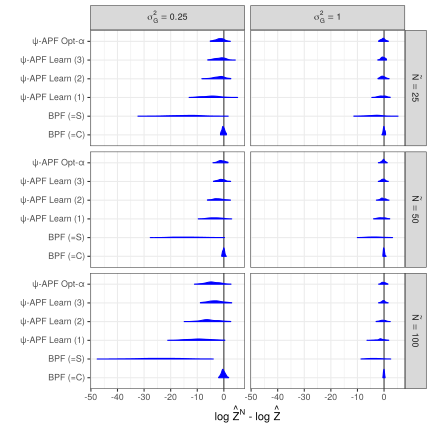
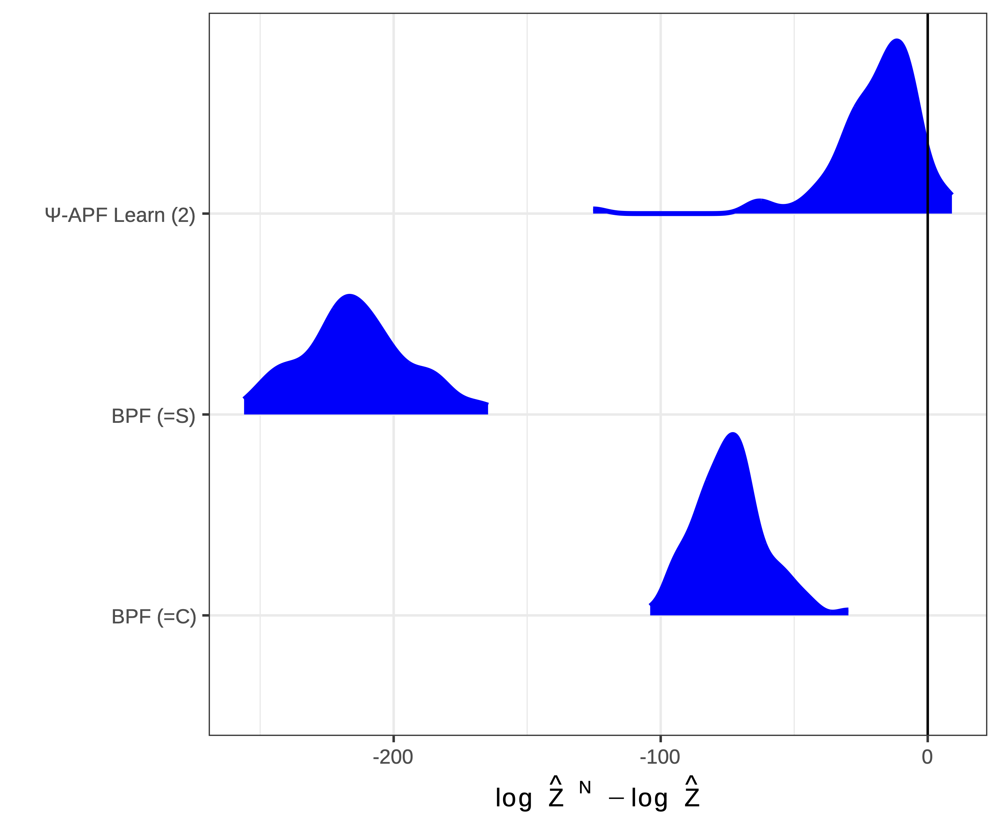

class: list-space

```{r setup, load_refs, include=FALSE, cache=FALSE}
library(ggplot2)
library(dplyr)
library(tidyr)
library(scales)
library(RColorBrewer)
library(kableExtra)
library(purrr)

library(RefManageR)
BibOptions(check.entries = FALSE,
           bib.style = "authoryear",
           cite.style = "authoryear",
           style = "html",
           hyperlink = FALSE,
           dashed = FALSE)
myBib <- ReadBib("biblio.bib", check = FALSE)

#### Helpers ####
capitalize <- function(string) {
  substr(string, 1, 1) <- toupper(substr(string, 1, 1))
  string
}

attach_name <- function(string, name){
  paste(name, "=", capitalize(string))
}

label_alg <- Vectorize(function(x){
  
  switch(x,
         smc_standard = "Standard",
         smc_da =  "DA+T",
         smc_da_no_trans = "DA",
         smc_sfa_da = "DA+T+SFA",
         smc_sfa_da_no_trans = "DA+SFA",
         smc_sfa = "SFA",
         smc_approx = "Approx"
         )
  
})

cr_label <- trans_format('log10', math_format(10^.x))

parse_labels <- function(values) {
  #values <- paste0("list(", values, ")")
  values <- gsub("`","", values)
  lapply(values, function(expr) c(parse(text = expr)))
}

flabeller <- labeller(likelihood = function(s) capitalize(s),
                      bss_model = function(s) attach_name(s, "Tuning"),
                      alg = function(s) label_alg(s),
                      cost_ratio = label_parsed,
                      iter_group = label_parsed,
                      beta = label_parsed
                      )

scientific_10 <- function(x, remove_1_times = F) {
  exp_text <- ifelse(x > 1,
         gsub("e\\+", " %*% 10^", scales::scientific_format()(x)),
         gsub("e", " %*% 10^", scales::scientific_format()(x))
  )
  
  if(remove_1_times){
    
    exp_text <- gsub("1 %*% ", "", exp_text, fixed = T)
    
  }

  parse(text = exp_text)
  
}

algs_list_sort <- c("smc_standard", 
                    "smc_da", "smc_da_no_trans", 
                    "smc_sfa_da", "smc_sfa_da_no_trans", 
                    "smc_sfa", "smc_approx")

algs_list_names <- c("Standard", 
                     "DA+T", "DA", 
                     "DA+T+SFA", "DA+SFA", 
                     "SFA", "Approx")

facet_label_scientific_rho <- function(x, rv = T){
  
  levels <- unique(x)
  labels <- ifelse(levels > 1,
                   gsub("e\\+", " %*% 10^", scales::scientific_format()(levels)),
                   gsub("e", " %*% 10^", scales::scientific_format()(levels))
  )
  
  labels <- paste("rho ==", gsub("1 %*% ", "", labels, fixed = T))
  
  if(rv){
    ordered(x, levels = rev(levels), labels = rev(labels))
  } else {
    ordered(x, levels = levels, labels = labels)
  }
}

facet_label_gamma <-  function(x){
  
  levels <- c("(0,3]", "(3,6]", "(6,9]", "(9,Inf]")
  new_labs <- c("group('{',list(1,2,3),'}')", 
                "group('{',list(4,5,6),'}')", 
                "group('{',list(7,8,ldots),'}')",
                "group('{',list(7,8,ldots),'}')")
  
  labels <- paste("gamma ==", new_labs)
  
  ordered(x, 
         levels = levels,
         labels = labels
  )
  
}

knitr::opts_chunk$set(cache = T)

source("visual-fk.R")

```
<style>

.list-space li {
padding: 0.25cm;
}

.list-nobullet li {
  list-style-type:none;
}

</style>

## Acknowledgements 

Joint work with 

- **Anthony Lee** (Bristol University) 
- **Christopher Drovandi** (QUT)


Institutions and Groups

- **School of Mathematical Sciences, QUT**
- **QUT Centre for Data Science**

---
class: list-space

## My research area

.full-width[.content-box-red[
**Adaptive methods** for sequential Monte Carlo **tuned with particles**
]]

--

This work...

.full-width[.content-box-blue[
Particle filters for dynamic models with **difficult/intractable transition densities**
]]

---

## Hidden Markov models

.pull-left[.content-box-purple[

- Inference over latent states
 - Time series
 - Robotics

- Unbiased estimate of normalising constant
 - Model selection
 - Pseudo-marginal methods

]]

.pull-right[

```{r hmm-tikz, echo=FALSE, eval=TRUE, fig.align='center', out.width= 600}

```

]

--

$$\hat{Z}_n = \int_{\mathsf{X}^{n+1}}m_0(x_0)G_0(x_0,y_0)\prod_{p=1}^{n}m_p(x_{p-1},x_{p})G_p(x_p,y_p)\text{d}x_0\cdots\text{d}x_n$$

- Mutation: $m_p$ is the density for $M_p$, potential: $G_p$ is the likelihood of $y_p$

- Particle filters exploit the conditional structure

---

## `r emo::ji("rainbow")` Everything is an integral

--

If $\mu$ is a probability distribution (or measure) on measurable space $(\mathsf{X},\mathcal{X})$,

for $S \in \mathcal{X}$ and measurable $\varphi:\mathsf{X}\rightarrow \mathbb{R}$

.content-box-purple[

$$\mu(S) = \int_{S} \mu(\text{d}x)$$
$$\quad \mu(\varphi) = \int_{\mathsf{X}} \varphi(x) \mu(\text{d}x)$$
]


--
<br>

- Distributions (or measures) defined implicitly by $\varphi(x) \mu(\text{d}x) \Longleftrightarrow \int_{S} \varphi(x) \mu(\text{d}x)$

---

## `r emo::ji("rainbow")` Everything is an integral

If $\mu$ is a probability distribution (or measure) on measurable space $(\mathsf{X},\mathcal{X}) = \color{red}{(\mathbb{R},\mathscr{B}(\mathbb{R}))}$,

for $S \in \mathcal{X}$ and measurable $\varphi:\mathsf{X}\rightarrow \mathbb{R}$

.content-box-purple[

$$\mu(S) = \int_{S} \color{red}{p_\mu(x)\text{d}x}$$

$$\mu(\varphi) = \int_{\mathsf{X}} \varphi(x) \color{red}{p_\mu(x)\text{d}x}$$
]


<br>
- Distributions (or measures) defined implicitly by $\varphi(x) \mu(\text{d}x) \Longleftrightarrow \int_{S} \varphi(x) \color{red}{p_\mu(x)\text{d}x}$


---
class: list-space

## `r emo::ji("rainbow")` Everything is an integral

If $K$ is a Markov kernel (or non-negative kernel) on measure space $(\mathsf{X},\mathcal{X})$,

for $v \in \mathsf{X}$, $S \in \mathcal{X}$, and measurable $\varphi:\mathsf{X}\rightarrow \mathbb{R}$

.content-box-purple[

$$K(v,S) = \int_{S} K(v,\text{d}x)$$

$$K(\varphi)(v) = \int_{\mathsf{X}} \varphi(x) K(v,\text{d}x)$$
]

--

- For a fixed $v \in \mathsf{X}$, $K(v,\cdot)$ is a measure
- $K(\varphi)(\cdot)$ is a measurable function, allows $\mu(K(\varphi))$ notation

---
class: inverse, center, middle, hide-logo

# From Feynman-Kac models to particle filters

---
class: list-space

## 1-step Feynman-Kac model

.pull-left[
```{r fk-viz-1, echo = F}

d_plot + theme(text = element_text(size = 20))

```
]
.pull-right[
.content-box-purple[
$$\eta_0 \overset{G_0}{\longrightarrow} \hat\eta_0 \overset{M_1}{\longrightarrow} \eta_1$$
]

]

---
class: list-space

## 1-step particle filter

.pull-left[
```{r fk-viz-2-1, echo = F}

d_plot + 
  ggdist::stat_dots(aes(y = name, dist = dist), data = s_df, colour = "black", fill = "black") + 
  theme(text = element_text(size = 19))

```
]
.pull-right[

.content-box-purple[
$$\eta_0^N \overset{G_0}{\longrightarrow} \hat\eta_0^N \overset{M_1}{\longrightarrow} \eta_1^N$$
]


]

---

## n-step model

With $\gamma_0 = M_0$ we can define marginal *predictive* **measures** and **distributions** via recursion 

.content-box-purple[
$$\gamma_{p}(S) = \int_{\mathsf{X}} \gamma_{p-1}(\text{d}x_{p-1})\color{red}{G_{p-1}(x_{p-1})}\color{blue}{M_{p}(x_{p-1},S)} \qquad\qquad
\eta_{p}(S) = \frac{\gamma_{p}(S)}{Z_p}$$
]

--

And *updated* counterparts

.content-box-purple[
$$\hat{\gamma}_{p}(\text{d}x_p) = \gamma_{p}(\text{d}x_p)\color{red}{G_p(x_p)} \qquad\qquad
\hat{\eta}_{p}(S) = \frac{\hat{\gamma}_{p}(S)}{\hat{Z}_p}$$
]

---

## Feynman-Kac summary

### Marginal space

$x_{p} \in \mathsf{X}$ for $p \in \{0,1,\ldots,n\}$

|             | Measure             | Distribution        |
| ----------- | :-----------------: | :-----------------: |
| Predictive  | $\gamma_p$          | $\eta_p$            |
| Updated     | $\hat{\gamma}_p$    | $\hat{\eta}_p$      |
| Normalised  | `r emo::ji("cross_mark")`| `r emo::ji("check")` |


---
class: list-space

## Feynman-Kac summary

- Feynman-Kac model defines
 - Path measure (and distribution)
 - Sequence of marginal distributions 
 - How we traverse these

--
- Infinitely many models to perform the same statistical inference

--
- Many **bad** models for SMC possible (variance of estimates)

--

<br>
.content-box-purple[

How do we improve an existing Feynman-Kac model (for use in SMC)?

]

---
class: inverse, center, middle, hide-logo

## Twisted Feynman-Kac models

---
class: list-space

## Twisting or change of measure

.content-box-purple[
$$\mu^\psi(\text{d} x) = \frac{\mu(\text{d} x) \psi(x)}{Z}$$
]

with $Z = \mu(\psi) = \int_{\mathsf{X}}\psi(x) \mu(\text{d} x) < \infty$.

--
- Exponential tilting/twisting: $\psi(x) = \exp(-\lambda x)$

--
- If continuous, new density $p_{\mu^{\psi}}(x) \propto p_\mu(x)\psi(x)$

---
class: list-space

## 1-step Twisted Feynman-Kac

.pull-left[
```{r fk-viz-1-tw, echo = F}

d_t_plot + theme(text = element_text(size = 20))

```
]
.pull-right[
.content-box-purple[
$$\eta_0^\psi \overset{G_0^\psi}{\longrightarrow} \hat\eta_0^\psi \overset{M_1^\psi}{\longrightarrow} \eta_1^\psi$$
]
- $\eta_1^\psi = \eta_1$, twisting preserves path/terminal **distribution**
- Using optimal $\psi$, **potentials** are constant

]

---
class: list-space

## 1-step TFK particle filter

.pull-left[
```{r fk-viz-2-tw, echo = F}

ds_t_plot + theme(text = element_text(size = 19))

```
]
.pull-right[
.content-box-purple[
$$(\eta_0^\psi)^N \overset{G_0^\psi}{\longrightarrow} (\hat\eta_0^\psi)^N \overset{M_1^\psi}{\longrightarrow} (\eta_1^\psi)^N$$
]
- Using optimal $\psi$, **weights** are constant
- And no resampling required
]

---

## Twisting Feynman-Kac models

Twist the Markov kernels with any measurable $\psi = \{\psi_0, \ldots, \psi_n\}$

.content-box-purple[
$$\begin{aligned}M^{\color{red}{\psi}}_0(\text{d}x_0) &= \frac{M_0(\text{d}x_0)\color{red}{\psi_0}(x_0)}{M_0(\color{red}{\psi_0})} \\
&~\\&~\\
M^{\color{red}{\psi}}_p(x_{p-1}, \text{d}x_p) &= \frac{M_p(x_{p-1}, \text{d}x_p)\color{red}{\psi_p}(x_p)}{M_p(\color{red}{\psi_p})(x_{p-1})}\end{aligned}$$
]

---

## Twisting Feynman-Kac models

Also "twist" the potential functions 

.content-box-purple[
$$\begin{aligned} G^{\color{red}{\psi}}_0(x_0) &= \frac{G_0(x_0)}{\color{red}{\psi_0}(x_0)}M_1(\color{red}{\psi_1})(x_0)M_0(\color{red}{\psi_0})\\
&~\\
G^{\color{red}{\psi}}_p(x_p) &= \frac{G_p(x_p)}{\color{red}{\psi_p}(x_p)}M_{p+1}(\color{red}{\psi_{p+1}})(x_p)\\
&~\\
G^{\color{red}{\psi}}_n(x_n) &= \frac{G_n(x_n)}{\color{red}{\psi_n}(x_n)}\end{aligned}$$
]

--

<br><br>
Defines new Feynman-Kac model, can be used by standard (e.g. bootstrap) particle filter

---

## Twisting Feynman-Kac models

Why??

$$\hat{\boldsymbol{\gamma}}^{\psi}_{n}(\text{d}x_{0:n}) = M_0^\psi(\text{d}x_0)G^{\psi}_0(x_0)\prod_{p=1}^{n}M_p(x_{p-1},\text{d}x_p)G^{\psi}_p(x_p)$$

--


.content-box-purple[
Preserves terminal quantities
$$\hat\eta^{\psi}_{n} = \hat\eta_{n}, \qquad\hat{\gamma}^{\psi}_{n} = \hat{\gamma}_{n}, \qquad \hat{Z}^{\psi}_n = \hat{Z}_n$$
]

--

But does change intermediate distributions, $\eta^{\psi}_p \neq \eta_p$

---

## Optimal twisting

If we use twisting functions that incorporate all future information

.content-box-red[
$$\psi_p^{\star}(x_p) = \mathbb{E}\left(\prod_{t=p}^{n}G_t(X_t)~\Big\vert~ X_p = x_p\right)$$
]

with $X_{0:n} \sim \boldsymbol{P}_n$ (the underlying Markov chain), then 

--

.content-box-purple[
$$(\hat{Z}^{\psi})^{N} \overset{a.s.}{=}  \hat{Z}$$ 
]

--

and **exact** samples from particle filter with finite $N$ (!) for the terminal distribution

---

## Iterated APF and Controlled SMC

- IAPF [(Guarniero et al, 2017)](https://doi.org/10.1080/01621459.2016.1222291) and CSMC [(Heng et al, 2020)](https://doi.org/10.1214/19-AOS1914) use twisted FK models
- Learn twisting functions using a recursion 

--

The optimal twisting functions satisfy

$$\psi_n^{\star}(x_n) = G_n(x_n)$$

$$\psi_p^{\star}(x_p) = G_p(x_p)M_{p+1}(\psi_{p+1}^{\star})(x_p)$$

--

Motivates recursive, iterative learning...

--

.content-box-purple[
**Algorithm:** For class of approximate twisting function $\tilde{\psi}_p \in \mathsf{H}$

1. Run particle filter with current $\psi$, generate $\zeta_p^i$
2. Find new approximation of $\tilde{\psi}_{p}(\zeta_p^i) \approx G_p(\zeta_p^i)M_{p+1}(\tilde{\psi}_{p+1})(\zeta_p^i)$ with backward recursion
3. Repeat
]

---

## Existing applications of recursive learning

Twisted mutation $M_p^{\psi}$ can be sampled from and constant $M_p(\psi_p)$ can be calculated **analytically**.

--

.content-box-purple[
Normal models and exponential-quadratic $\psi$
$$M_p = \mathcal{N}(f(x_{p-1}),\Sigma)$$
$$\psi_p(x_p) = \exp\left(- x_{p}^{\top} A x_{p} + bx_{p} + c \right)$$
where $A$ is PSD.

Then $M_p^{\psi}(x_{p-1}, \cdot) = \mathcal{N}(f_{\psi}(x_{p-1}),\Sigma_{\psi})$ can be calculated **analytically**
]


--
`r emo::ji("exclamation_mark")` Almost all current methods are for Gaussian mutation kernels and twisting functions

---
class: inverse, center, middle, hide-logo

## Beyond exact twisting `r emo::ji("star")`

---

## Extending beyond the analytical case 

What if there is no class of appropriate $\psi$ functions that are tractable?

- $M_p$ intractable or difficult to work with
- $M_p^{\psi}$ unable to be sampled from directly

--
<br><br><br>
.content-box-blue[
**Idea**: Rejection sampler + Unbiased estimate of twisted potentials
]

---
class: list-space

## Extending beyond the analytical case 

### Rejection sampler

- Restrict $\psi: \mathsf{X}\rightarrow [0,1]$
- Propose $X \sim M_p$ until $\psi_p(X) > U$, where $U \sim \text{Uniform}(0,1)$

--

Accepted realisations have the correct twisted distribution: $X \sim M_p^{\psi}$

---
## Extending beyond the analytical case 

### Unbiased estimate of twisted potentials

$$\tilde{G}_p^{\psi}(x_p) = \frac{G_p(x_p)}{\psi_p(x_p)}\color{green}{\tilde{M}_{p+1}(\psi_{p+1})(x_p)}$$

--

.content-box-purple[

$$\tilde{M}_{p+1}(\psi_{p+1})(x_p) = K^{-1}\sum_{i=1}^{K}\psi_{p+1}(U^{i}_{p+1}) \qquad \qquad \qquad U^{i}_{p+1} \sim M_{p+1}(x_p, \cdot)$$

]

---
class:list-space

## Twisted models by rejection-sampling and unbiased potentials

Applicable to **any** Feynman-Kac model with bounded $\psi$ and where mutations can be sampled from, using 

--

.pull-left[.content-box-purple[
**Rejection sampler** for twisted mutation kernel

- Exact twisting
- Potentially costly sampler
]]


--
.pull-right[.content-box-purple[
**MC estimate** for twisted potential function

- Simple 
- Potentially noisy estimate
]]


--

<br><br><br>
How to address concerns?

---
class: list-space

## Controlling cost of rejection sampler

Rejection sampler for $M^{\omega}_p$ has acceptance rate: 

$$M_p(\omega_p)(x_{p-1}) = \int_{\mathsf{X}}\omega_p(x_p)M_p(x_{p-1}, \text{d}x_p)$$
Normalising constant conditional on $x_{p-1}$.


--
Average acceptance rate (rejection sampler within SMC sampler) is

.content-box-purple[
$$\begin{aligned}
\alpha_p^{\omega} &= \hat{\eta}_{p-1}^{\omega}(M_p(\omega_p)) ~\text{for}~p=1,\ldots,n\\ 
\alpha_0 &= M_0(\omega_{0})\end{aligned}$$
]

--

How to estimate before running the particle filter (for $p\neq 0$)?

---

## Controlling cost of rejection sampler

.content-box-red[
**Prop.** If we have a $\psi$-twisted Feynman-Kac model, then the average acceptance rates of a $\omega$-twisted model can be written as

$$\begin{aligned}
\alpha_{p}^{\omega} &=  \frac{\hat\eta_{p-1}^{\psi}( M_{p}(\omega_{p})^2 \cdot M_{p}(\psi_{p})^{-1} )}{\hat\eta_{p-1}^{\psi}( M_{p}(\omega_{p}) \cdot M_{p}(\psi_{p})^{-1})} ~\text{for}~p \in [n]
\end{aligned}$$
]


--
`r emo::ji("exclamation_mark")` A quantity for average RS acceptance rates within a particle filter


--
`r emo::ji("double_exclamation_mark")` Estimate without running the particle filter for the $\omega$-twisted FK model


--
.content-box-purple[
**Target $\alpha$**: Use in the iterative learning algorithm and temper the new twisting functions
]


---
class: list-space

## Sketch of proof

`r emo::ji("point_right")` New twisting functions decomposed as $\omega_p = \psi_p \cdot \phi_p$

Two nice properties

- $(\hat\gamma_{p-1}^{\psi})^\phi = \hat\gamma_{p-1}^{\psi\cdot\phi}$
- $\hat\gamma_{p-1}^\phi(\text{d} x_{p-1}) = \hat{\gamma}_{p-1}(\text{d} x_{p-1}) M_{p}(\phi_{p})(x_{p-1})$


--
Yields

- $\hat{\gamma}_{p-1}^{\omega}(\text{d} x_{p-1}) = \hat{\gamma}_{p-1}^{\psi}(\text{d} x_{p-1}) M_{p}^{\psi}(\phi_{p})(x_{p-1})$


--
Use to express $\hat{\eta}_{p-1}^{\omega}(M_p(\omega_p))$ without $\omega$-twisting

And substitute $M_{p}^{\psi}(\phi_{p}) = \frac{ M_{p}(\omega_{p})}{M_{p}(\psi_{p})}$ everywhere


---

## Analysing PF variance with estimate of twisted potentials

.content-box-red[
**Prop**: If the relative variance of random-potential is uniformly bounded, that is
$$
\mathrm{Var}\left(\frac{\tilde{G}_p(\tilde{x}_p)}{G_p(x_p)}~\Big\vert~ x_p\right) < C
$$
then the asymptotic variance satisfies

$$\tilde{\sigma}_n^{2}(\varphi \otimes 1) < (C+1) \sigma_n^{2}(\varphi)$$
]

---
class: list-space

## Rough sketch of proof

- Define a new equivalent Feynman-Kac model on augmented state-space $X_p, U_p$
    - $U_p \sim M_{p+1}(x_p, \cdot)$
- Asymptotic variance

$$\begin{aligned}
\tilde{\sigma}^2_n(\varphi \otimes 1) &= N^{-1}\sum_{p=0}^{n} \tilde{v}_{p,n}(\varphi \otimes 1)
\end{aligned}$$

Bound each $\tilde{v}_{p,n}(\varphi)$ using  $\mathrm{Var}\left(\frac{\tilde{G}_p(\tilde{x}_p)}{G_p(x_p)}~\Big\vert~ x_p\right) < C$

--

<br><br>
`r emo::ji("exclamation_mark")` Effect of using estimate is isolated, does not compound (asymptotically)


---

## Example: Linear Gaussian Hidden Markov model

Model

- $d=3$, $n = 200$
- $a_0 = [1~1~1]$, $\Sigma_0 = I_{d}$
- $\Sigma_M = I_{d}$
- $\Sigma_G = \sigma^2_{G}I_{d}$ with $\sigma^2_{G} \in \{0.25,1.0\}$
- $A$ are such that $A_{i,j} = a^{\vert i-j\vert + 1}$ with $a = 0.42$

Algorithm

- Exponential quadratic twisting function
- 3 iterations of iterative learning
    - $\alpha$ target $= 0.04, 0.02, 0.01$
- $N = 200$ particles for twisted models
- Dynamic multinomial resampling with $N/2$ threshold
- $\tilde{N} \in \{25,50,100\}$
 
Tested over 100 repetitions

- compare against memory (S = particle storage)
- computation (C = number of mutation draws)

---


```{r twist-rej, echo=FALSE, eval=TRUE, fig.align='center', out.width= 640}

```

---
class: list-space

## Partial exact twisting

.content-box-red[
With tempering, controlling acceptance rate alters twisting functions from those learned. 
]


--
For some Markov kernels

- Decompose twisting functions $\psi_p = \varrho_p \cdot \omega_p$ such that
- An exact sampler for $M_p^\varrho$ exists
- Then use rejection sampling for remainder $\omega_p$


--
.content-box-blue[
**Idea**: Choose $\varrho_p$ to maximise acceptance rates
]

---

## Stochastic Volatility Model

.content-box-purple[
$R_t$ returns with variance $X_t$ governed by
$$\begin{split}
    R_t &= X_t^{1/2}Z_t \\
    d X_t &= (\phi_1 - \phi_2 X_{t}) d t +\phi_3 X_t^{1/2} dW_t
\end{split}$$
]

- $Z_t \sim \mathcal{N}(0,\sigma^2)$
- Brownian motion $W_t$
- Model from e.g. [Martin et al, 2019](https://doi.org/10.1080/10618600.2018.1552154)

--


- Unit increments of $X_t$ follow scaled non-central chi-square distribution
- Can be exponentially tilted


---
## Example: Stochastic Volatility Model

Data

- $n = 2000$
- $\phi_1 =0.1$, $\phi_2 = 0.5$, $\phi_3 = 0.1$, and $\sigma = 0.25$ 

Model

- $\phi_1 =0.09$, $\phi_2 = 0.45$, $\phi_3 = 0.11$, and $\sigma = 0.25$

Algorithm

- Exp-quadratic twisting (rejection) + Exp-linear twisting (analytical)
- 2 iterations of iterative learning, $N = 100$
- Final twisted particle filter  $N = 250$
- Dynamic multinomial resampling with $N/2$ threshold
 
Tested over 100 repetitions

- compare against memory (S = particle storage)
- computation (C = number of mutation draws)

---

```{r sv-res, echo=FALSE, eval=TRUE, fig.align='center', out.width= 700}

```


---
class: list-space

## Conclusions

- Twisting models can define perfect samplers

--
- Analytical twisting limited to only few models (i.e. Bayesian conjugacy)

--
- Extend with rejection sampling, high 'naive' computational cost but memory usage reduced

--
- Partial-rejection options may be available

--
- Future: new models, identify characteristics of models that will benefit (computational aspect)

---
class: inverse, center, middle, hide-logo

## Thank you for listening!
